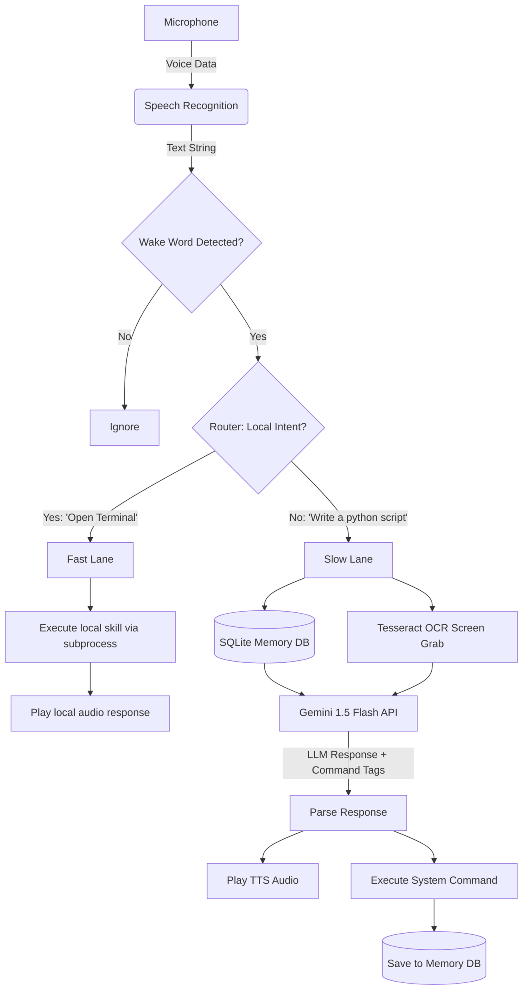
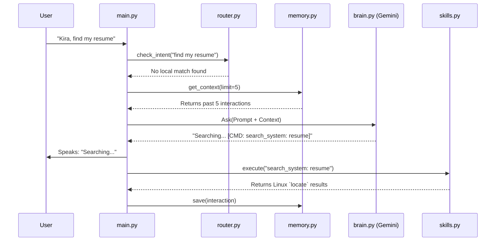

# K.I.R.A(**Kernel Integrated Response Assistant**)

K.I.R.A. is a lightweight, fully autonomous desktop AI assistant built for Linux environments. Designed specifically to run efficiently on lower-end hardware (e.g., i3 processors, 4GB RAM) without sacrificing intelligence, K.I.R.A. utilizes a **Hybrid Architecture**: handling heavy cognitive tasks via the Cloud (Gemini 1.5 Flash) while managing memory, vision, and system execution entirely locally.

---

## ✨ Key Features
* **Vocal Interface:** Always listening for wake words using calibrated Google Speech Recognition.
* **Animated GUI:** A borderless, draggable, transparent PyQt6 widget that animates based on state (Idle, Thinking, Speaking).
* **"God Mode" System Control:** Can generate and execute arbitrary Linux terminal commands (via Konsole) safely.
* **Hybrid Intent Routing:** Bypasses the LLM for hardcoded tasks ("Open Terminal") for 0.5s response times, routing only complex queries to the cloud.
* **Persistent Memory:** Uses a local SQLite database to maintain conversational context across sessions.
* **Screen Reading (OCR):** Can capture screenshots and read text locally using Tesseract OCR, giving the AI "vision" without heavy VRAM requirements.

---

## 🧠 System Architecture

K.I.R.A. uses a bifurcated pipeline (The Fast Lane vs. The Slow Lane) to ensure maximum speed and minimum API usage.



---

## 📂 Project Structure

```text
KiraAI/
├── .env                  # API keys (Not tracked by Git)
├── .gitignore            # Ignored files (cache, audio dumps)
├── requirements.txt      # Required Packages and Libraries       
├── run_kira.py           # Main entry point (Python wrapper)
├── run.sh                # Shell launcher (Activates venv & runs app)
├── Kira.desktop          # Linux Desktop Icon file(may or may not be visible)
├── assets/
|   ├── sounds/           # Sound
|   |   └──wake.wav              
│   ├── idle.gif          # GUI Animations(add gifs)
│   ├── talking.gif       # GUI Animations(add gifs)
│   └──thinking.gif       # GUI Animations(add gifs)
│   
└── src/
    ├── __init__.py       # package manager
    ├── main.py           # The Core Loop (Listening, Routing, Emitting Signals)
    ├── gui.py            # PyQt6 Transparent Interface
    ├── brain.py          # Gemini API Integration & Prompt Engineering
    ├── voice.py          # Text-to-Speech handling
    ├── skills.py         # Subprocess wrappers (The "Hands")
    ├── router.py         # The Fast-Lane Intent Matcher
    ├── tools.py          # Advanced Agent Tools (Screen reading, File writing)
    ├── memory.py         # SQLite Database Manager
    └── config.py         # System Prompts and Environment variable loaders

```

---

## ⚙️ How It Works (The Execution Loop)



---

## 🛠️ Installation & Setup

**1. System Dependencies (Debian/Ubuntu/KDE):**
K.I.R.A. requires several Linux-level packages to control the system and read screens.

```bash
sudo apt update
sudo apt install tesseract-ocr libtesseract-dev plocate konsole xclip
sudo updatedb # Builds the search index for plocate

```

**2. Python Environment:**

```bash
cd KiraAI
python3 -m venv .venv
source .venv/bin/activate
pip install SpeechRecognition python-dotenv google-generativeai pygame PyQt6 pytesseract pillow psutil

```

**3. Environment Variables:**
Create a `.env` file in the root directory:

```ini
GEMINI_API_KEY=your_gemini_api_key_here

```

**4. Launching:**

```bash
chmod +x run.sh
./run.sh

```

---

## 🔧 How to Tweak and Customize

K.I.R.A. is highly modular. Here is how you can customize her to fit your exact needs:

### 1. Change Her Personality

Open `src/config.py` and edit the `SYSTEM_PROMPT`. You can change her name, her attitude, or add strict rules on how she must reply.

### 2. Add "Fast Lane" Instant Commands

Want her to open a specific game or app instantly without using API credits?
Open `src/router.py` and add to the `intent_map` dictionary:

```python
"open steam": ("terminal: steam", ["Booting up Steam, Senpai!", "Gaming time!"]),

```

### 3. Change the Avatar

Replace the GIFs in the `assets/` folder.

* Note: Ensure your GIFs have a transparent background.
* Keep the filenames exactly the same (`idle.gif`, `talking.gif`, `thinking.gif`), or update the paths in `src/gui.py`.

### 4. Adjust Microphone Sensitivity

If she is triggering randomly or ignoring you, open `src/main.py` and adjust the `r.energy_threshold` (lower = more sensitive to quiet sounds, higher = requires louder voice).

```python
r.energy_threshold = 1500 # Adjust this value (1000 - 4000)

```

---

## ⚠️ Known Limitations & Linux Quirks

* **Wayland vs X11:** Transparent, frameless PyQt6 windows cannot be dragged on KDE Wayland due to security protocols. **Workaround:** Hold the `Alt` key and left-click the avatar to drag the window natively via the OS.
* **Microphone Indexing:** If USB devices are plugged/unplugged, the Linux ALSA audio index may shift. If K.I.R.A. hangs on "Calibrating", explicitly set `device_index=` in `src/main.py`.
* **Sudo Commands:** Dangerous commands generated by the LLM are purposely spawned in a visible `konsole` window requiring manual password entry. Do not automate `sudo` passwords.

---
